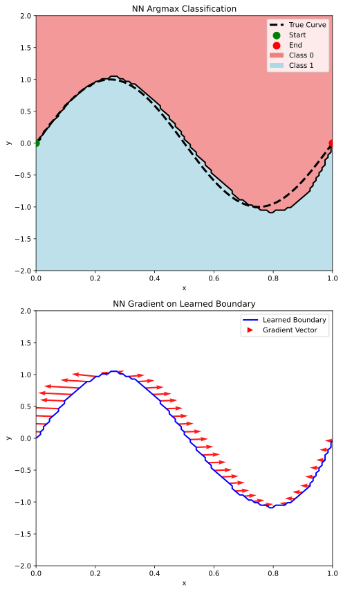
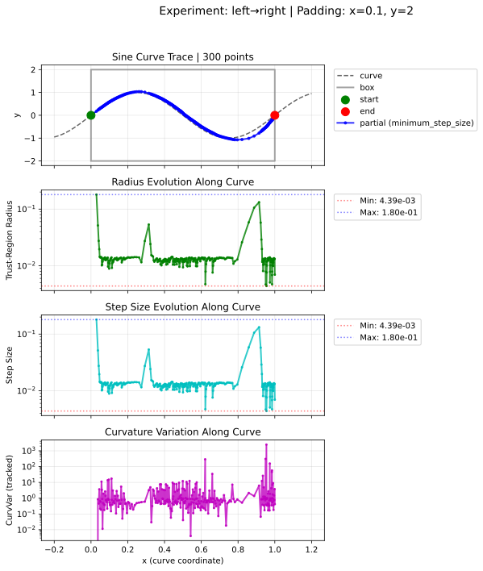

# Neural Network Tracer Experiment

This experiment traces a sine curve by training a small neural network to learn its implicit function and then following that field from one boundary point to another.

## Problem
Given the sine wave \(y = \sin(2\pi x)\), trace the segment between \(x=0\) and \(x=1\) within a padded box.

## Data generation
20,000 random points are labelled by the analytical function to create training data for the network.

## Learning and tracing
A Flax model learns the implicit function from 12,000 samples over 400 epochs. The learnt surface and gradient field guide a trust-region tracer that links the boundary points.

## Trace result
The tracer follows the sine curve across the box and reports its progress.

All figures are saved under `docs/`.
